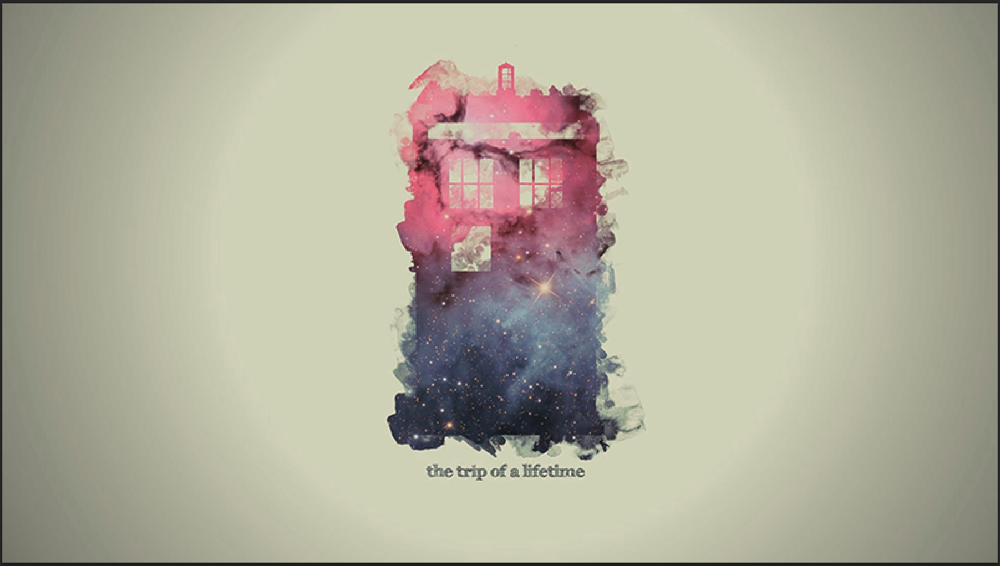
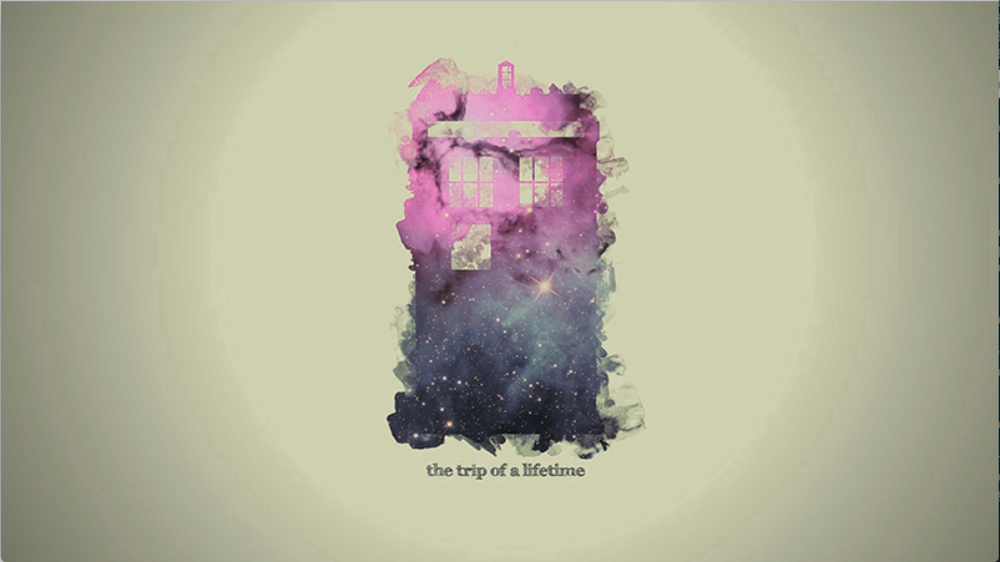
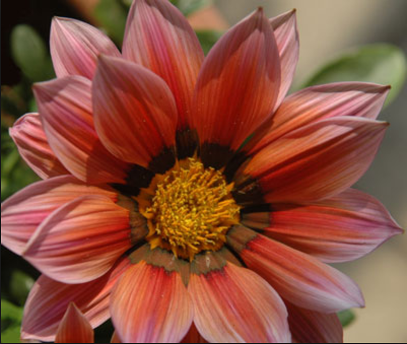
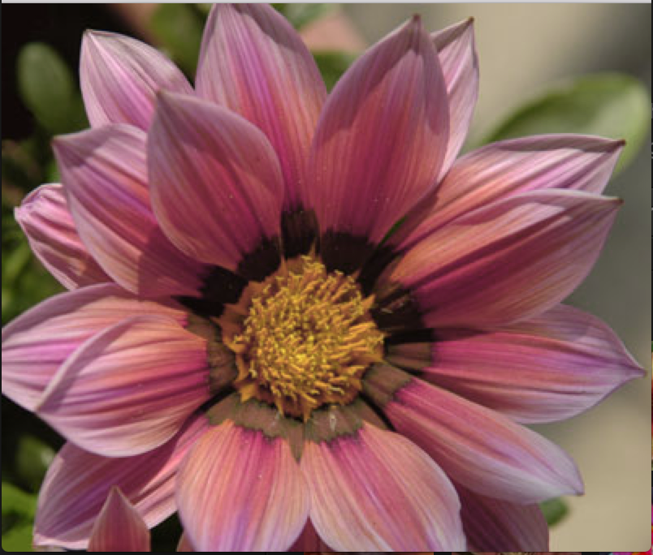

# Color Correction
Color correction for red and green color blindness using the Daltonization process. Aids in distinguishing certain colors apart to help those with deuteranopia.

# How to use:

Run makefile by "make"

Then run the program by `./ColorCor [-l/u] src`

# Parameters:

- -l : Local file, enter the directory of a file you want to process
- -u : Url, enter the url of the image you want to process

#Examples:

####Before:

####After:

####Before:

####After:

####Before:

####After:

